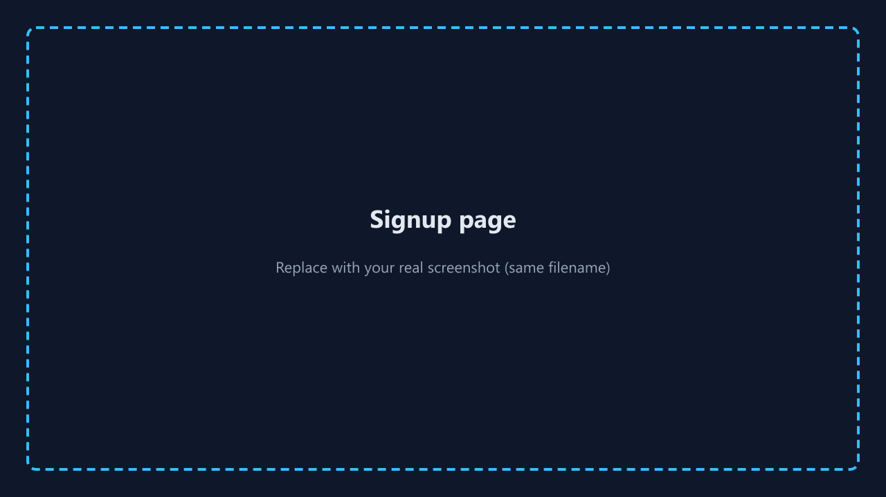
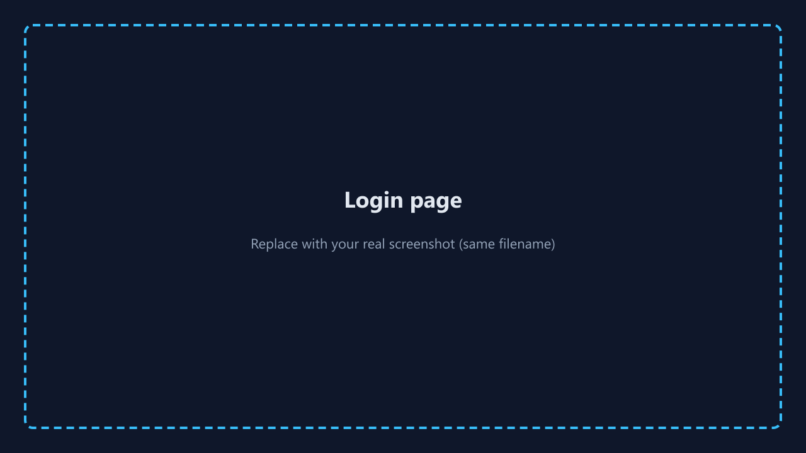
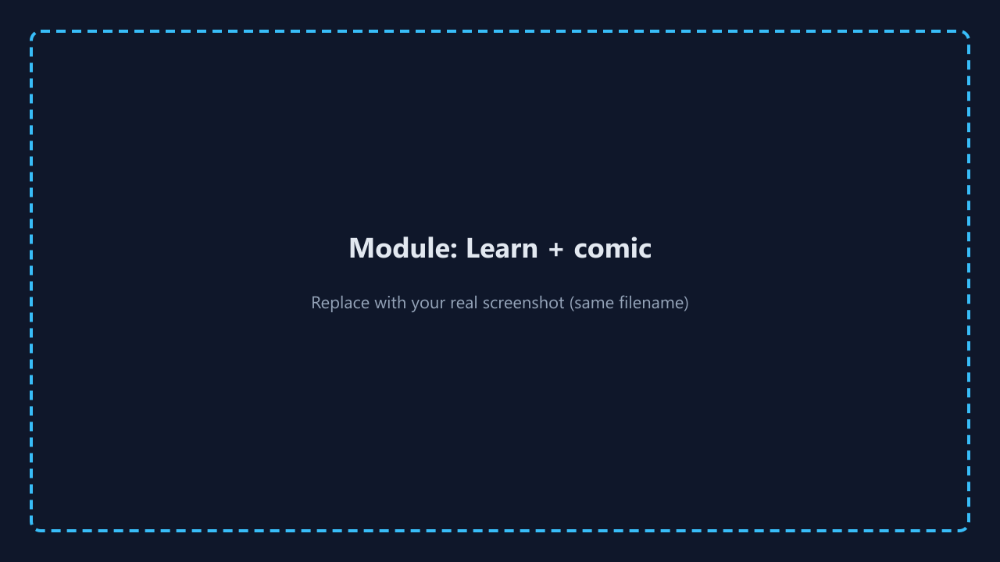
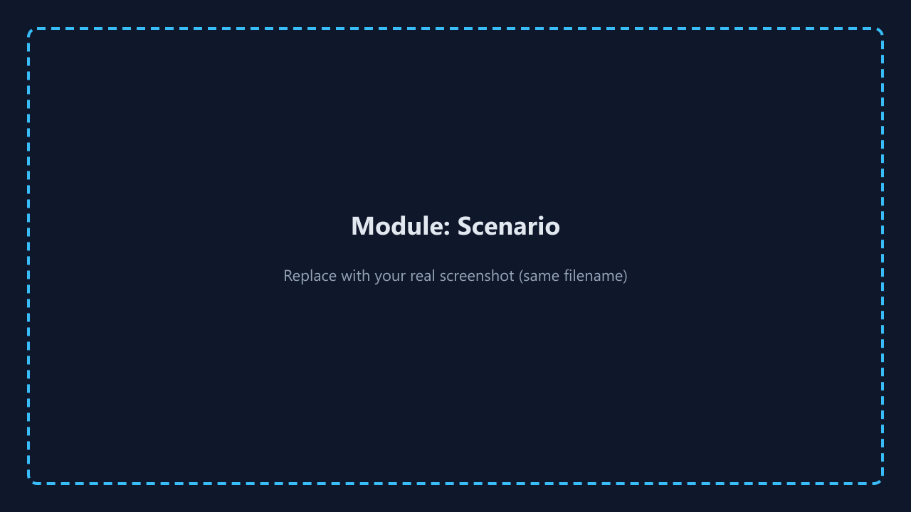
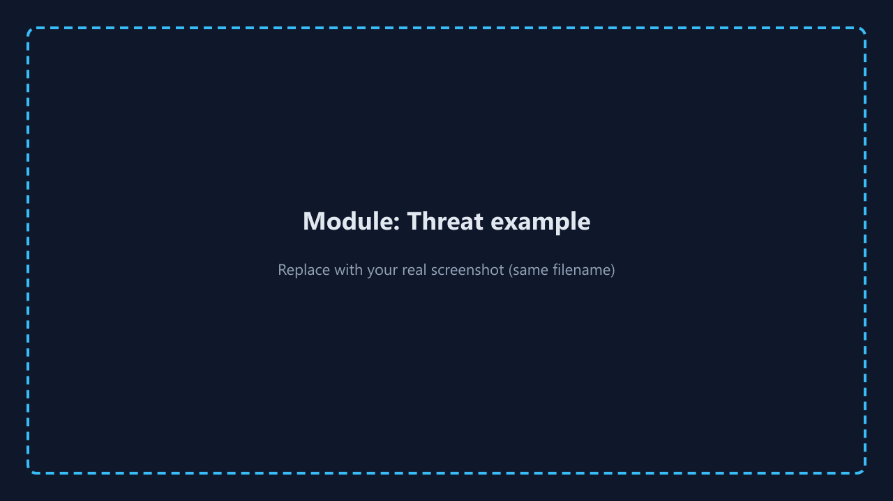
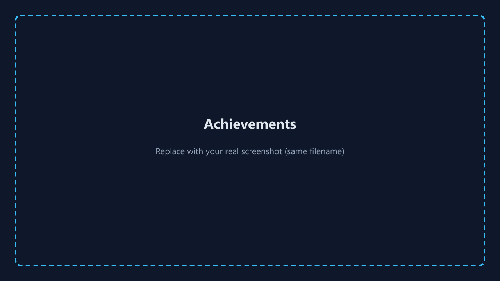
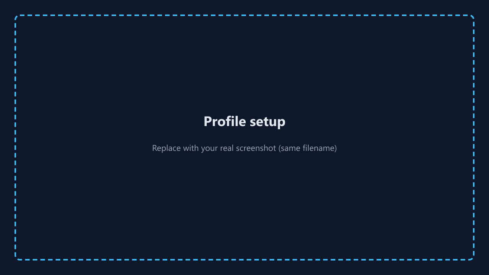

# CyberAware — User guide (end user)

**Product:** CyberAware — web-based cybersecurity awareness training  
**Audience:** Learners (employees, students, or general users)  
**Team lead:** Janvi Arora | **Course:** COMP 4495 S002  

This document belongs in **`DocumentsAndReports/`** on the `main` branch, as required for the final submission. **Replace screenshot placeholders** below with real captures from your running app (`png` or `jpg`), stored in `DocumentsAndReports/screenshots/`.

---

## 1. What CyberAware is

CyberAware helps you **learn security concepts** through short lessons, **practice** with realistic scenarios, and **prove understanding** with quizzes. You earn **XP**, unlock **modules in order**, and collect **achievements**.

---

## 2. Before you start

- You need an **email address** and a **password** (minimum length enforced at signup).
- Your organization (or instructor) should provide a **running instance** of the app URL, or you run it locally following **`README.md`** / **Appendix A** of the final report.
- The app uses **Supabase** for accounts; you must complete **email confirmation** if your project has it enabled in Supabase Auth settings.

---

## 3. Creating an account

1. Open the CyberAware **home** page.  
2. Click **Start your run** (or **Sign up**).  
3. Enter **email**, **password**, and **confirm password**.  
4. Submit the form. If Supabase is not configured on the deployment, you will see a clear configuration message—contact your administrator.

**Screenshot placeholder**

---

## 4. Signing in

1. Click **Sign in** (from the header or landing page).  
2. Enter **email** and **password**.  
3. After success, you are taken to the **dashboard**.

**Screenshot placeholder**

---

## 5. Dashboard

The **dashboard** summarizes your **XP**, **level**, **modules completed**, and quick links to **missions** and **achievements**.

**Screenshot placeholder**

---

## 6. Mission board (modules)

1. Open **Missions** / **Modules** from the navigation.  
2. You see a **grid of module cards**. Locked modules appear **blurred** on the back until prerequisites are met.  
3. **Flip** a card (where supported) to preview topics.  
4. Click to open an **unlocked** module.

**Screenshot placeholder**

---

## 7. Inside a module

Each module is organized into **parts**:

| Part | What you do |
|------|-------------|
| **1 — Learn** | Read **key points**, view the **comic strip**. |
| **2 — Scenario** | Read the scenario (e.g. email or message). **Choose** the best action. Read feedback. |
| **3 — Quiz** | Answer all questions, **Submit quiz**. You need at least **half** correct to pass (see on-screen result). |
| **4 — Threat example** | Read a **real-world-style** story linking the lesson to actual risks. |

**Screenshot placeholders**

---

## 8. Progress, XP, and levels

- Passing a module awards **XP** (shown on the module and dashboard).  
- Your **tier** (e.g. Beginner → Expert) depends on **total XP**.  
- Progress is stored **per account** so returning users can continue.

---

## 9. Achievements

1. Open **Achievements** from the navigation.  
2. View **earned** vs **locked** badges and **progress bars** toward the next reward.  
3. Badges are tied to milestones such as **first module completed**, **halfway**, **all modules**, and **high XP**.

**Screenshot placeholder**

---

## 10. Profile

1. Open **Profile** (or complete **profile setup** if prompted).  
2. Set your **display name**, optional **organization** and **role**, and choose an **avatar** emoji.  
3. Save. Your name appears in relevant UI areas.

**Screenshot placeholder**

---

## 11. Signing out

Use **Log out** in the header when you are finished, especially on a **shared computer**.

---

## 12. Troubleshooting

| Issue | What to try |
|-------|-------------|
| Blank or error on load | Ask admin to confirm **Supabase URL and anon key** are set for the deployment. |
| Cannot log in | Reset password via Supabase **forgot password** flow if enabled; check email spelling. |
| Progress missing | Ensure you are using the **same account**; check network; ask admin to verify database tables (`user_progress`). |

---

## 13. Privacy note

Do **not** enter real corporate secrets into training scenarios. Use the platform for **learning** only unless your organization has approved it for production data.

---

*End of user guide. Pair this file with real screenshots before submission.*
