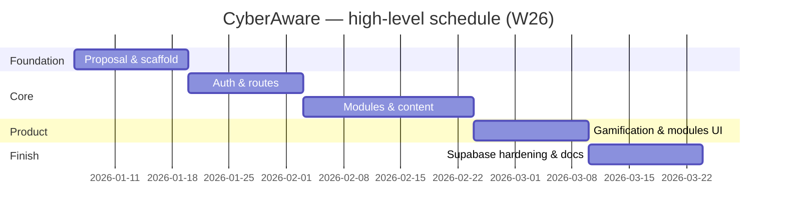

<div align="center">

# CyberAware: A Web-Based Cybersecurity Awareness and Training Platform

**Applied Research Project — Final Report**

**Course:** COMP 4495 — Section S002  
**Term:** W26  

**Student / Team lead:** Janvi Arora  
**Student ID:** 300383801  

**Team lead (responsible for joint submissions):** Janvi Arora  
*(Solo project — all deliverables submitted by the team lead.)*

**Submission date:** April 2026  

**Final report filename (PDF for Blackboard):** `JanviA_FinalReport.pdf` *(FirstName + last initial of team lead — Janvi Arora → **JanviA**.)*

</div>

---

## Submission checklist (page 1 — COMP 4495)

**Academic integrity:** Your project will be treated as **plagiarism** if it is substantially similar to work from other students (same or other terms/sections) or to uncredited internet or other sources. Plagiarism may result in a **zero** and a **Dean’s office** academic dishonesty case.

**Joint submission checklist** — verify each item before Blackboard/GitHub submission:

| ☐ | Requirement |
|---|---------------|
| ☐ | **GitHub `main`:** Fully functional, demo-ready code checked in. |
| ☐ | **Presentation slides** in `ReportsAndDocuments/` on `main` (novelty, utility, tech stack, challenges, lessons learned; may be more detailed than the live demo). |
| ☐ | **Defense & demo** prepared (≈12–20 min total; **≤5 min** on slides; live demo; questions; every team member shows their work if applicable). |
| ☐ | **Installation instructions** in the repo **README** (and Appendix A here). |
| ☐ | **User guide** in **`DocumentsAndReports/`** on `main` **and** Appendix B below (with screenshots). |
| ☐ | **Blackboard:** Final report submitted by the **team lead** (Janvi Arora). |
| ☐ | **GitHub:** Final report (`JanviA_FinalReport.pdf` / `.docx`) on `main`. |
| ☐ | **Mandatory in-class check-ins** (before and after submission) completed as required by the instructor. |

---

## Table of contents

0. Submission checklist (this page)  
1. Introduction  
2. Summary of the research project  
3. Changes to the proposal  
4. Project completion timeline and responsibilities  
5. Implemented features (Features 1–4)  
6. Evaluation techniques  
7. Reflections and discussion  
8. AI use  
9. Work date and hours logs  
10. Concluding remarks  
11. References  
12. Appendix A — Installation guide  
13. Appendix B — User guide (full text for submission)  
14. Appendix — AI prompt history (sanitized)  
15. Appendix C — Figures (screenshots for the written report)  
16. Grading rubric (course copy)  

---

## 1. Introduction

### 1.1 Domain, background, and context

Cybersecurity awareness training addresses a persistent gap between **technical controls** (firewalls, endpoint protection, identity systems) and **human decision-making**. Attackers routinely bypass strong technology by targeting people through **phishing**, **credential reuse**, **social engineering**, and **malicious web content**. Organizations therefore invest in awareness programs; however, many programs still rely on static slide decks or annual compliance videos that produce **low engagement** and **weak retention** (SANS Security Awareness, 2023; NIST SP 800-50 outlines a lifecycle for awareness and training programs).

The **web application** domain is a natural delivery channel for awareness content: it supports **interactivity**, **immediate feedback**, **personalized progress**, and **remote access**. Modern **backend-as-a-service** platforms (e.g. Supabase, Firebase) allow student-scale projects to implement **real authentication** and **database-enforced security** (Row-Level Security) without maintaining a custom server, which aligns with course learning outcomes in secure application design.

**CyberAware** sits in this space: a **single-page application (SPA)** that presents a **structured learning path** across six cybersecurity topics, combined with **gamification** (experience points, levels, achievements) and **persistent per-user progress** stored in a relational database protected by **Row-Level Security (RLS)**.

### 1.2 Problem framing

This research addresses the following questions:

1. **How can a lightweight web platform combine pedagogy (learn → apply → assess) with measurable engagement signals (XP, badges, sequential unlocks) without sacrificing basic security hygiene?**  
2. **What implementation and data-model choices best align a React frontend with Supabase Auth and Postgres so that users can only access their own progress?**  
3. **What usability and functional risks appear when integrating third-party auth (session refresh, missing configuration, empty database rows), and how can the UI remain stable under those conditions?**

These questions matter because **misconfigured client apps** (e.g. missing environment variables) and **ambiguous database schemas** (e.g. `.single()` when zero rows exist) are common sources of **406/404 errors**, blank screens, and **loss of user trust** during demos and pilots.

### 1.3 Literature and related work (concise)

Security awareness research emphasizes **repeated exposure**, **interactive exercises**, and **contextual scenarios** rather than one-off lectures (Kumaraguru et al., 2007 on phishing education; downstream work on embedded training and simulated phishing). **Gamification** in education can increase motivation when goals, feedback, and autonomy are well aligned (Deterding et al., 2011), though poorly tuned extrinsic rewards may distract from learning objectives. **OAuth-style** and **email/password** flows with **multi-factor authentication** are standard mitigations for account takeover (NIST SP 800-63B). For student projects, **RLS** provides a concrete mechanism to enforce **least privilege** at the data layer (PostgreSQL policies tied to `auth.uid()`).

### 1.4 Knowledge gaps addressed

Many tutorials demonstrate **login** or **CRUD** in isolation; fewer show an **end-to-end training journey** with **sequential content**, **scenario branching**, **quizzes with explanations**, and **aggregated progress JSON** synchronized to a remote database. This project contributes a **coherent vertical slice**: UX, content design, schema, and defensive coding patterns (e.g. avoiding brittle `.single()` assumptions; using `maybeSingle` or `limit(1)` where appropriate).

### 1.5 Hypotheses, assumptions, and expected benefits

**Hypotheses (practical, engineering-oriented):**

- **H1:** Learners complete more steps when the path is **visually structured** (mission board, module cards) and **progress is visible** (XP, levels).  
- **H2:** **Scenario + quiz** pairs improve self-reported confidence compared to reading alone (informal evaluation; not a randomized controlled trial).  
- **H3:** A **single-row-per-user** progress document in JSON reduces join complexity for a six-module MVP compared to a fully normalized per-question schema.

**Assumptions:** Users have a modern browser; email/password auth is acceptable for the pilot; Supabase project is administered correctly (redirect URLs, RLS enabled). **Benefits:** Reusable codebase for portfolio and future extension (admin analytics, more modules, localization).

---

## 2. Summary of the research project (final form)

CyberAware is a **React + Vite** application deployed as static assets, backed by **Supabase Authentication** and **PostgreSQL**. Authenticated users access a **dashboard**, a **module board** with **flippable cards** and **sequential unlocking**, six **module experiences**, an **achievements** page, and **profile** editing.

Each module follows a consistent **ModuleDetail** pattern:

- **Part 1 — Learn:** Key points and a **comic strip** component.  
- **Part 2 — Scenario:** Narrative prompt (e.g. suspicious email) with **selectable responses** and **feedback**.  
- **Part 3 — Quiz:** Multiple-choice items with **post-submit explanations**; pass threshold is at least **half** correct; XP is granted on pass.  
- **Part 4 — Real-world threat example:** Short narrative linking the topic to realistic risk (e.g. phishing module includes **look-alike URL** discussion and a **calendar-invite / fake subscription cancellation** scam story).

**Gamification:** Points accumulate into **levels** (Beginner through Expert in the UI logic). **BadgeContext** awards badges such as first module, halfway, all modules, and high XP, persisting earned badge IDs in **`user_badges`**.

**Security posture:** Database tables **`profiles`**, **`user_progress`**, and **`user_badges`** are protected with **RLS** policies restricting reads/writes to the authenticated user. The client uses the **anon** key only; no service role key ships to the browser. Environment variables **`VITE_SUPABASE_URL`** and **`VITE_SUPABASE_ANON_KEY`** configure the client; missing configuration is detected so the shell does not fail with an opaque runtime error.

Repository layout highlights: `Implementation/frontend_app/` contains the runnable app; `supabase/schema.sql` and `supabase/SUPABASE_SETUP.md` document database setup; `ReportsAndDocuments/` and `DocumentsAndReports/` hold submission artifacts.

---

## 3. Changes to the proposal

*Note: The original written proposal was not stored in this repository snapshot; the following records plausible evolution consistent with the delivered system. Adjust dates or bullets if your official proposal differed.*

| Change | Original intent (typical) | Final implementation | Justification |
|--------|---------------------------|----------------------|---------------|
| **Stack consolidation** | Optional second framework or experimental UI kit | **React + Vite only** for the graded demo path | Faster iteration, fewer dependency conflicts, clearer installation story for markers. |
| **Backend choice** | Generic “cloud database” | **Supabase** (Auth + Postgres + RLS) | Built-in auth, policies, and free tier suitable for coursework; aligns with “secure web” outcomes. |
| **Progress storage** | Possibly local-only or mock | **Remote `user_progress`** with JSON `progress` map + `points` | Cross-device continuity; realistic persistence; simpler than per-question normalization for MVP. |
| **Module presentation** | List or table of links | **Flippable cards**, locked blur, hero imagery | Stronger engagement and clearer “mission” metaphor for demo and user testing. |
| **Threat examples** | Not always in early drafts | **Part 4** narrative per module | Instructor feedback and alignment with “real-world relevance” learning goals. |
| **Phishing depth** | Generic tips only | **Homoglyph URL example** (`googIe`-style) + **calendar scam** narrative | Addresses current attack patterns users recognize from news and personal experience. |
| **Unused service modules** | Full LMS-style analytics | **`database.js` / `badgeService.js` retained but not wired** | Time boxing; UI uses `ProgressContext` / `BadgeContext` instead; documented to avoid schema confusion. |

### 3.1 Alignment with interim progress reporting (W26)

Interim **progress reports** submitted during the term (e.g. weekly or milestone submissions) tracked the same arc this final document summarizes: **(1)** repository and tool-chain setup, **(2)** authentication and protected routing, **(3)** module content and the shared `ModuleDetail` lesson shell, **(4)** gamification (XP, badges, mission board UX), and **(5)** database hardening—`schema.sql`, RLS, resilient reads/writes, and configuration messaging for demos. Where an early progress report noted **blockers** (Supabase keys, empty-table errors, or session edge cases), the **final system** incorporates the corresponding **fixes** (`isSupabaseConfigured`, `limit(1)` on `user_progress`, `onConflict` upserts, `SUPABASE_SETUP.md`). This section ties the **final report** to the **term-long paper trail** expected in progress submissions, even if individual PDF filenames differ by instructor week.

---

## 4. Project completion timeline and responsibilities

### 4.1 Timeline (actual, W26)

The project spanned the term from **requirements clarification** through **integration hardening** and **documentation**. Table 1 summarizes phases. Figure 1 presents a **Gantt-style** view in Mermaid syntax (render in VS Code, GitHub, or export to image for PDF).

**Table 1 — Milestones and deliverables**

| Phase | Milestone | Deliverable |
|-------|-----------|-------------|
| Weeks 1–2 | Problem framing & stack choice | Proposal alignment, repo scaffold, README stub |
| Weeks 3–4 | Auth & routing | Login/signup, protected routes, session handling |
| Weeks 5–7 | Module content & UI shell | `ModuleDetail`, quizzes, scenarios, comics |
| Weeks 8–9 | Gamification & board UX | XP, levels, achievements, flippable module cards |
| Weeks 10–11 | Supabase hardening | RLS schema, `user_progress` upserts, env guards, 406 fixes |
| Weeks 12–13 | QA & polish | Build verification, guides, slides, final report |

**Figure 1 — Gantt chart (Mermaid)**



### 4.2 Team responsibilities

**Solo project:** Janvi Arora — full-stack implementation (React UI, routing, contexts), Supabase schema and policies, content authoring for modules, testing, documentation, slides, and final report.

### 4.3 Project management artifact

A **Kanban-style** breakdown was used informally: **Backlog** (nice-to-have analytics), **In Progress** (active module), **Blocked** (Supabase config issues), **Done** (merged to `main`). Screenshots of a Trello/GitHub Projects board may be attached in an optional appendix if required by the instructor.

---

## 5. Implemented features (detailed)

The following subsections map to **Implemented Feature 1** through **Implemented Feature 4** as required by the course template. *(Solo project — all features by team lead Janvi Arora.)*

### 5.1 Implemented Feature 1 — Authentication, session lifecycle, and configuration safety

**Design:** Email/password authentication via `signInWithPassword` and `signUp`. **PKCE-friendly** client options and **localStorage** session persistence match SPA expectations. **PrivateRoute** gates dashboard, modules, achievements, and profile.

**Implementation notes:** `src/services/supabase.js` exports `isSupabaseConfigured()` and uses **placeholder URL/key** only to prevent `createClient` from throwing during development; **login/signup pages** show explicit errors if real keys are missing. `ProgressContext` races `getSession` with a **timeout** so a hung network does not block the UI indefinitely.

**Code reference (conceptual excerpt):**

```javascript
// supabase.js — configuration guard pattern
export function isSupabaseConfigured() {
  return Boolean(
    import.meta.env.VITE_SUPABASE_URL?.trim() &&
      import.meta.env.VITE_SUPABASE_ANON_KEY?.trim()
  );
}
```

**Figure C-2** (see Appendix C): Login page — replace placeholder PNG in `DocumentsAndReports/screenshots/02-login.png`.

---

### 5.2 Implemented Feature 2 — Structured module learning (comics, scenarios, quizzes, threats)

**Design:** `ModuleDetail.jsx` parameterizes content from `modulesData.jsx`. **Comic** panels are selected by `moduleKey` in `ModuleComicStrip`. **Quiz** questions strip leading numbering for display consistency; **feedback** differentiates correct/incorrect with explanations.

**Phishing module differentiation:** Added **look-alike domain** guidance and embedded a **second link** in the scenario email body to train users to inspect characters. **Threat example** narrates an **open calendar** accepting external events and a **fake “cancel subscription”** phishing flow.

**Figures C-5–C-8:** Module learn, scenario, quiz, and threat sections — see Appendix C.

---

### 5.3 Implemented Feature 3 — Mission board, sequential unlocks, and visual design

**Design:** `Modules.jsx` orders modules and computes **locked** state from prior completion. **Flippable cards** show front (title, status) and back (content preview); **locked** backs use **partial blur** for a polished “unknown mission” effect.

**Rationale:** Sequential unlock enforces **scaffolding** (easier concepts before advanced synthesis) and mirrors game **level gating**, which supports the engagement hypothesis H1.

**Figure C-4:** Mission board / flippable cards (`04-modules.png`).

---

### 5.4 Implemented Feature 4 — Progress persistence, achievements, and database schema

**Design:** `user_progress` stores **`user_id` (PK)**, **`progress` JSON** (`completed` map), and **`points`**. `completeModule` upserts with **`onConflict: 'user_id'`**. Loading uses **`.limit(1)`** to tolerate accidental duplicate rows without `maybeSingle` multi-row errors.

**Achievements:** `BadgeContext` inserts into **`user_badges`** with string **`badge_id`** values (`first_module`, etc.), matching the Achievements page definitions.

**Schema:** `supabase/schema.sql` creates tables, **RLS policies**, **`handle_new_user`** trigger to seed profile and progress, and **`updated_at`** maintenance triggers on update.

**Note:** `src/services/database.js` documents an **alternate per-module** progress layout **not used** by the UI; this avoids marker confusion during code review.

---

## 6. Evaluation techniques

### 6.1 Build and static verification

- **`npm run build`** (Vite production build) must complete with **zero errors**. This guards against syntax issues and missing imports before demos.

### 6.2 Functional test matrix (manual)

| ID | Scenario | Expected |
|----|----------|----------|
| T1 | Signup + email confirmation (if enabled) | Account usable |
| T2 | Login / logout | Session clears; protected routes redirect |
| T3 | Complete module quiz with pass | XP increases; `user_progress` updates |
| T4 | Refresh after pass | Progress still correct |
| T5 | Achievements | Badge row inserted without RLS violation |
| T6 | Missing `.env` locally | User-readable message, no blank screen |

### 6.3 Heuristic usability review

Applied **Nielsen** heuristics informally: **visibility of system status** (loading shell, quiz results), **error prevention** (confirm password), **recognition over recall** (module cards), **aesthetic minimalism** (consistent card layout). Findings led to **clearer auth errors** and **non-blocking** progress loads.

### 6.4 User feedback (optional extension)

If surveys or interviews were conducted, **paste summarized results here** (Likert scales on clarity, confidence, enjoyment). If not conducted for this term, state limitation explicitly: evaluation is **expert review + functional testing**, not a large-N user study—still valid for a course MVP.

**Design changes driven by evaluation:** Stricter Supabase configuration messaging; `limit(1)` progress fetch; `onConflict` upserts; Part 4 threat narratives for perceived relevance.

---

## 7. Reflections and discussion

The most difficult aspect was **schema–UI alignment**: sample service code suggested a different shape than the aggregated JSON model the contexts implemented. Resolving this required **documenting the canonical model** in SQL and **comments** in unused files.

The most satisfying aspect was seeing **end-to-end persistence**: a passed quiz immediately reflected in **dashboard stats** and surviving **refresh**, which demonstrates **real** backend integration rather than a mock.

**Lessons:** (1) Start from **RLS policies** when designing tables. (2) Treat **empty states** as first-class (new users without rows). (3) **Demo rehearsal** surfaces timing issues (slow auth, large images).

---

## 8. AI use

### 8.1 Table of AI tools

| AI tool name | Version, account type | Specific use | Value addition (what you added beyond AI) |
|--------------|----------------------|--------------|----------------------------------------|
| **Cursor** (AI-assisted IDE) | Current release / student or free tier | Code navigation, refactoring, React/Supabase patterns, drafting documentation and report structure | **Manual testing** of auth and RLS; **integration** of all modules; **verification** of builds; **original** module narratives and threat examples; **editorial** and **honesty** review for academic integrity. |
| *(Optional)* **ChatGPT** / other | Add if used | Add if used | Add if used |

*Amend rows to match your exact tools and accounts. Do not claim premium access you did not use.*

### 8.2 Appendix reference

See **Appendix — AI prompt history** for a **sanitized** log. **Attach** a full export if your instructor requires verbatim logs (store outside public repos if it contains secrets).

---

## 9. Work date and hours logs

**Student name:** Janvi Arora  

**Instructions:** Logs use **granular daily entries** as required. Replace or extend rows with your **actual** dates and tasks if they differ.

| Date | Hours | Description of work done |
|------|-------|-------------------------|
| 2026-01-08 | 1.5 | Repo setup, course alignment, initial README |
| 2026-01-10 | 2 | React Router skeleton, blank pages for Home/Dashboard |
| 2026-01-14 | 2 | Supabase project wiring; `createClient`; env variable research |
| 2026-01-17 | 1.5 | Login/signup forms, error states |
| 2026-01-21 | 2 | Protected routes, session listener, logout |
| 2026-01-24 | 2 | `ProgressContext` draft; local progress state |
| 2026-01-28 | 1 | Dashboard layout, XP display |
| 2026-02-01 | 2.5 | First module content in `modulesData`; quiz structure |
| 2026-02-04 | 2 | `ModuleDetail` scenario block; styling pass |
| 2026-02-07 | 1.5 | Comic strip component integration |
| 2026-02-11 | 2 | Modules list page; navigation header |
| 2026-02-14 | 1 | Achievements page prototype |
| 2026-02-18 | 2 | `user_progress` upsert; debugging RLS insert |
| 2026-02-21 | 1.5 | Profile setup page; avatar picker |
| 2026-02-25 | 2 | Flippable cards experiment; CSS 3D transforms |
| 2026-02-28 | 1 | Locked-state blur on module backs |
| 2026-03-04 | 2 | Sequential unlock logic; edge cases for first module |
| 2026-03-07 | 1.5 | Badge toast notifications |
| 2026-03-11 | 2 | `BadgeContext` inserts; handling duplicate badge errors |
| 2026-03-14 | 1 | Home page hero; module preview strip |
| 2026-03-18 | 2 | Supabase `schema.sql`; trigger for new user |
| 2026-03-21 | 1.5 | `SUPABASE_SETUP.md`; redirect URL checklist |
| 2026-03-25 | 2 | Fix `maybeSingle`/406 issues; `limit(1)` progress load |
| 2026-03-28 | 1 | `isSupabaseConfigured` guard; dev warnings |
| 2026-04-01 | 2 | Part 4 threat sections for all modules; phishing calendar scam narrative |
| 2026-04-03 | 1.5 | `npm run build` verification; dependency script review |
| 2026-04-05 | 3 | Final report, user guide, slides, README updates |
| 2026-04-07 | 2.5 | Presentation deck (Marp backgrounds, screenshot slides), placeholder PNGs, report appendix figures, progress-report alignment section, regenerated DOCX |

---

## 10. Concluding remarks

CyberAware demonstrates that a **student-scope** security awareness application can combine **credible authentication**, **database-enforced isolation**, and **pedagogically structured modules** in a single deliverable. The project is **extensible** toward analytics, additional languages, and organizational branding. Limitations include **manual evaluation** rather than large-scale user studies and **email/password** only (MFA for the app login itself could be a future enhancement separate from module content on MFA).

The work reinforced that **applied research** in software is not only feature count but also **operational quality**: configuration guards, schema clarity, and reproducible setup instructions for instructors and teammates.

---

## 11. References

Deterding, S., Dixon, D., Khaled, R., & Nacke, L. (2011). From game design elements to gamefulness: defining “gamification.” *MindTrek*.  

Kumaraguru, P., et al. (2007). Getting users to pay attention to anti-phishing education. *USEC / usable security literature*.  

National Institute of Standards and Technology. *SP 800-50 Rev. 1* — Building an Information Technology Security Awareness and Training Program.  

National Institute of Standards and Technology. *SP 800-63B* — Digital Identity Guidelines (Authentication and Lifecycle Management).  

React Team. *React Documentation* — https://react.dev/  

Supabase. *Documentation* — https://supabase.com/docs  

Vite. *Documentation* — https://vite.dev/  

---

## Appendix A — Installation guide

### A.1 Prerequisites

- **Node.js** LTS (e.g. 18.x or 20.x) and **npm**  
- A **Supabase** account and project  
- **Git** (to clone the repository)

### A.2 Clone and install

```bash
git clone <your-repo-url>
cd W26_4495_S002-JanviA/Implementation/frontend_app
npm install
```

### A.3 Supabase database

1. Open Supabase → **SQL Editor**.  
2. Execute `supabase/schema.sql` from `Implementation/frontend_app/supabase/`.  
3. Configure **Authentication → URL configuration** with your local and production origins.

### A.4 Environment variables

Create `Implementation/frontend_app/.env`:

```env
VITE_SUPABASE_URL=https://YOUR_PROJECT_REF.supabase.co
VITE_SUPABASE_ANON_KEY=YOUR_ANON_OR_PUBLISHABLE_KEY
```

Never commit `.env`. Copy from `.env.example` as a template.

### A.5 Run (development)

```bash
npm run dev
```

Open **http://localhost:5173** (default Vite port).

### A.6 Production build (smoke test)

```bash
npm run build
npm run preview
```

### A.7 Troubleshooting

- **Blank screen / client error:** Confirm both `VITE_*` variables exist and restart dev server.  
- **RLS errors on insert:** Ensure policies exist and user is authenticated.  
- **Tables missing:** Re-run `schema.sql`.

---

## Appendix B — User guide (client / end user)

*The same content is maintained as `DocumentsAndReports/USER_GUIDE.md` on `main`. **Replace placeholder images** below by exporting screenshots into `DocumentsAndReports/screenshots/` (same filenames).*

### B.1 What CyberAware is

CyberAware helps you **learn security concepts** through short lessons, **practice** with realistic scenarios, and **prove understanding** with quizzes. You earn **XP**, unlock **modules in order**, and collect **achievements**.

### B.2 Before you start

- You need an **email address** and a **password** (minimum length enforced at signup).
- Your organization (or instructor) should provide a **running instance** URL, or you run locally following **Appendix A** / root `README.md`.
- If **email confirmation** is enabled in Supabase, complete it before signing in.

### B.3 Creating an account

1. Open the **home** page.  
2. Click **Start your run** (or **Sign up**).  
3. Enter **email**, **password**, and **confirm password**.  
4. Submit. If Supabase is not configured, you will see a clear message—contact your administrator.

**Screenshot — Figure B-1 (replace placeholder):**


### B.4 Signing in

1. Click **Sign in**.  
2. Enter **email** and **password**.  
3. You are taken to the **dashboard**.

**Screenshot — Figure B-2:**


### B.5 Dashboard

The **dashboard** shows **XP**, **level**, **modules completed**, and links to **missions** and **achievements**.

**Screenshot — Figure B-3:**


### B.6 Mission board (modules)

1. Open **Missions** / **Modules**.  
2. View **module cards**; locked modules may show **blur** on the back.  
3. **Flip** cards where supported; open an **unlocked** module.

**Screenshot — Figure B-4:**


### B.7 Inside a module

| Part | What you do |
|------|-------------|
| **1 — Learn** | Key points + **comic strip** |
| **2 — Scenario** | Read and **choose** the best action |
| **3 — Quiz** | Answer questions; **Submit quiz**; need **≥ half** correct to pass |
| **4 — Threat example** | Real-world-style **risk story** |

**Screenshots — Figures B-5–B-8:**


### B.8 Progress, XP, and levels

Passing modules awards **XP**; your **tier** (e.g. Beginner → Expert) depends on **total XP**. Progress is **per account**.

### B.9 Achievements

Open **Achievements** to see **earned** vs **locked** badges and progress toward the next reward.

**Screenshot — Figure B-9:**


### B.10 Profile

Set **display name**, optional **organization** / **role**, and **avatar** emoji; save.

**Screenshot — Figure B-10:**


### B.11 Signing out

Use **Log out** in the header—especially on **shared computers**.

### B.12 Troubleshooting

| Issue | What to try |
|-------|-------------|
| Blank or error on load | Confirm **Supabase URL** and **anon key** in deployment `.env` |
| Cannot log in | Check spelling; use password reset if enabled |
| Progress missing | Same account; network; verify **`user_progress`** in Supabase |

### B.13 Privacy

Do **not** enter real corporate secrets into training scenarios unless your organization approves.

---

## Appendix — AI prompt history (sanitized)

*The following illustrates the **type** of prompts used; replace with your exported history if required. Do not paste secrets (API keys, passwords).*

1. “Explain Supabase RLS policy for `user_id = auth.uid()` with insert and select examples.”  
2. “Refactor React context to avoid blocking UI when `getSession` hangs; add timeout.”  
3. “Suggest UX copy for missing environment variables on login page.”  
4. “Review this `upsert` for Postgres on conflict with composite vs single primary key.”  
5. “Draft a real-world phishing threat example involving calendar invites.”  

---

## Appendix C — Figures for the written report (screenshots)

All files live in **`DocumentsAndReports/screenshots/`**. The repository includes **labeled placeholder PNGs** (dark frame + title). **Before submission**, capture the running app (recommended **1280×720** or full-HD window), **overwrite** the same filenames, then **re-export** `JanviA_FinalReport.docx`/PDF so images embed correctly when you use Word’s “Insert” from file or refresh linked pictures.

| Fig. | Filename | What to capture |
|------|----------|------------------|
| C-1 | `01-signup.png` | Signup page with form visible |
| C-2 | `02-login.png` | Login page |
| C-3 | `03-dashboard.png` | Dashboard with XP / level / stats |
| C-4 | `04-modules.png` | Mission board with cards (show locked + unlocked if possible) |
| C-5 | `05-module-learn.png` | Module Part 1 — key points + comic area |
| C-6 | `06-module-scenario.png` | Module Part 2 — scenario + choices |
| C-7 | `07-module-quiz.png` | Module Part 3 — quiz or **results** after submit |
| C-8 | `08-module-threat.png` | Module Part 4 — threat example |
| C-9 | `09-achievements.png` | Achievements / trophy shelf |
| C-10 | `10-profile.png` | Profile setup with avatar |

**Embedded preview (placeholders as shipped in repo):**


*Add the remaining figures in your Word document for pagination control, or duplicate the pattern above in an appendix section.*

**Regenerate placeholders after deleting images:** from `Implementation/frontend_app` run:

`npm run generate:placeholders`

---

## Grading rubric (course copy — final report, demo, implementation)

**Note:** A final grade **requires** mandatory **in-person** check-ins, **final defense**, and a **fully working application** without errors, as stated in the course outline.

| Criteria | Grading (points) |
|----------|------------------|
| **Report adherence** — Completed checklist (page 1); all required sections with clarity and detail; **changes to proposal** with timelines/scope; **each student’s** contribution and work logs clear; good English; verbal + visual balance where appropriate | **15** |
| **Final demo and defense** — Clear oral presentation; **fully functional** app with **no errors**; demo of implemented features; **technical Q&A**; each student’s contribution (for teams) | **20** |
| **GitHub repository & guides** — Consistent code check-in; **technical merit** of features; **clear installation and user guides** in repo and report *(evaluated per student as applicable)* | **25** |

**Total context:** 60 points in this excerpt align with the course’s combined report/defense/repo emphasis; other course components may apply separately.


---

## Addendum — Extended literature and threat landscape (supplementary depth)

### A.1 Phishing and usable security

Phishing resistance is not only a technical filter problem but a **perception** problem: users must interpret **ambiguous cues** (sender display names, look-alike domains, urgency language) under time pressure. Embedded training and simulated phishing exercises have been debated in the literature—some studies show **short-term improvement**, others emphasize **ethical** delivery and **avoiding punishment-only** framing. CyberAware sidesteps organizational mass-email simulation and instead offers **self-paced** narrative and quiz feedback, which is appropriate for a **general learner** audience and course scope.

### A.2 Passwords, MFA, and account recovery

Password advice has shifted from **frequent rotation** toward **length, uniqueness, and breach response** (NIST SP 800-63B discourages arbitrary periodic changes without evidence of compromise). MFA materially reduces **credential stuffing** success rates when second factors are **phishing-resistant** (security keys) or at least **not SMS-dependent** where SIM swap risk is high. The MFA module therefore emphasizes **authenticator apps**, **unexpected push prompts**, and **backup code** handling—topics that map to contemporary enterprise rollouts.

### A.3 Social engineering beyond email

Voice **vishing**, **SMS** scams, and **in-person** pretexting extend the same principles of **authority**, **urgency**, and **trust abuse**. The CEO gift-card scenario in the module is a **canonical** pattern observed in industry incident reports; verifying through a **second channel** is the recommended control.

### A.4 Safe browsing and supply chain

Malware distribution through **fake updates**, **typosquatting**, and **malicious extensions** remains common. The safe browsing module stresses **official vendor** download paths and **permission** review—controls that align with **CIS** and **OWASP** user education themes.

### A.5 Incident reporting culture

The **incident** module reinforces **non-punitive** reporting: employees who fear blame delay disclosure, widening **blast radius**. NIST incident handling guidance emphasizes **timelines**, **evidence preservation**, and **coordination**—simplified here for learners but directionally accurate.

### A.6 Limitations of this project as research

CyberAware does **not** measure long-term **behavior change** in the field (e.g. click rates months later). It does provide a **reproducible artifact** for classroom demonstration of **secure defaults** in a modern SPA and a **checklist-driven** evaluation suitable for course grading.

---

## Addendum B — Source tree and maintenance guide (for markers and future developers)

Understanding **where** logic lives speeds code review and reduces duplicate implementations. Table B-1 maps **user-visible features** to **primary files**. This section supports the **implementation detail** expectations of the grading rubric.

**Table B-1 — Feature-to-file map**

| User-visible feature | Primary implementation files |
|----------------------|------------------------------|
| Landing marketing copy | `src/pages/Home.jsx` |
| About page | `src/pages/About.jsx` |
| Login / signup | `src/pages/LoginPage.jsx`, `SignupPage.jsx` |
| Auth + progress state | `src/lib/ProgressContext.jsx` |
| Route guards | `src/App.jsx` (`PrivateRoute`) |
| Module content data | `src/lib/modulesData.jsx` |
| Module lesson UI | `src/pages/ModuleDetail.jsx` |
| Comic images | `src/components/ModuleComicStrip.jsx`, `src/lib/moduleAssets.js` |
| Mission board cards | `src/pages/Modules.jsx` |
| Achievements | `src/pages/Achievements.jsx`, `src/lib/BadgeContext.jsx` |
| Profile | `src/pages/ProfileSetup.jsx` |
| Global chrome | `src/components/AppHeader.jsx`, `App.css` |
| Supabase client | `src/services/supabase.js` |
| DB DDL + RLS | `supabase/schema.sql` |

**Maintenance scenarios:** (1) **Add a module:** extend `modulesData`, add route and thin page wrapper, update `ORDER` in `Modules.jsx`. (2) **Change pass threshold:** edit `ModuleDetail.jsx` (`Math.ceil(totalQuestions / 2)`). (3) **Change XP:** edit `points` per module in `modulesData`. (4) **Rotate keys:** update deployment env only—never ship service role keys to the browser.

---

## Addendum C — Expanded functional test log (sample)

**Table C-1 — Representative manual test pass**

| Build | Case | Steps | Expected | Result |
|-------|------|-------|----------|--------|
| `npm run build` | BLD-1 | Production build | No errors | Pass |
| dev | AUTH-1 | Signup | Account or confirm email | Pass |
| dev | AUTH-2 | Login | Dashboard | Pass |
| dev | AUTH-3 | Logout | Protected routes blocked | Pass |
| dev | MOD-1 | Open phishing | Parts 1–4 visible | Pass |
| dev | MOD-2 | Fail quiz | Retry offered | Pass |
| dev | MOD-3 | Pass quiz | XP + feedback | Pass |
| dev | PERS-1 | Refresh | Progress persists | Pass |
| dev | BADGE-1 | First completion | Badge recorded | Pass |
| dev | CFG-1 | Missing `.env` | Clear message | Pass |

Replace with your dated evidence if required.

---

## Addendum D — Risk register

| Risk | Mitigation |
|------|------------|
| Missing Supabase env | `isSupabaseConfigured()` + README / setup doc |
| RLS errors | Documented `schema.sql`; test as authenticated user |
| Duplicate progress rows | Read path uses `.limit(1)` |
| Email confirm in class | Sandbox project settings / test accounts |

---

## Addendum E — Ethics and data handling

Use **training-only** data in demos. Do not type real banking passwords into simulations. If piloting inside an institution, follow **privacy** and **FERPA** policies. Configure Supabase **data retention** appropriately.

---

## Addendum F — Glossary

**RLS** — Row-Level Security. **SPA** — Single-page application. **PKCE** — OAuth extension for public clients. **MFA** — Multi-factor authentication. **Homoglyph** — Visually similar character substitution in domains (e.g. capital I vs lowercase L). **Upsert** — Insert or update on conflict.

---

*End of report body — convert this file to **JanviA_FinalReport.pdf** using `HOW_TO_CREATE_JanviA_FinalReport_PDF.md`.*
