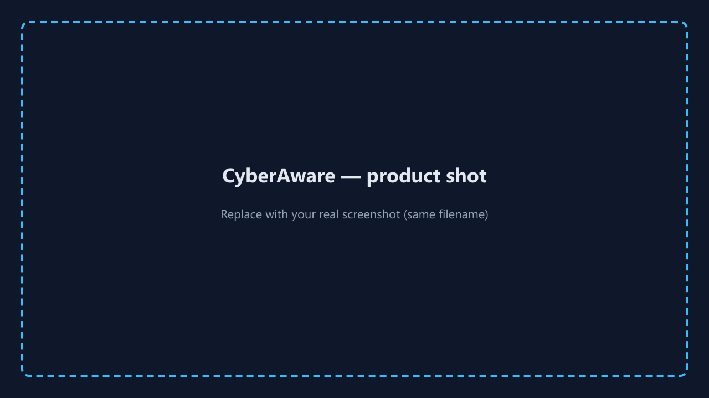

<!-- 
  EXPORT: Install "Marp for VS Code" → open this file → Export Slide Deck → PowerPoint (.pptx) or PDF.
  SCREENSHOTS: PNGs live in DocumentsAndReports/screenshots/ — placeholders are generated; overwrite files
  with real captures (same names) before your defense. Re-export the deck.
-->



# **CyberAware**
## Web-Based Cybersecurity Awareness & Training Platform

**Team lead:** Janvi Arora · **ID:** 300383801  
**Course:** COMP 4495 — Section S002 · **Term:** W26

---

# Course submission checklist

**GitHub `main` · Slides in `ReportsAndDocuments/` · README install · `DocumentsAndReports` user guide · Blackboard (team lead) · In-class check-ins**

☐ Code demo-ready ☐ Slides checked in ☐ Install + user docs ☐ Final report PDF/DOCX ☐ Defense ready (12–20 min; **≤5 min** slides)

---

# Agenda

1. Problem & why it matters  
2. What we built (demo overview)  
3. Tech stack & architecture  
4. Features with **screenshots**  
5. Challenges, evaluation & demo plan  
6. Q&A  

---

# Problem & context

- People are the **#1 target**: phishing, weak passwords, social engineering, unsafe browsing.  
- Long policy PDFs → **low engagement**; users need **practice + feedback**.  
- **Goal:** One **account-based** path: **learn → scenario → quiz → real threat story**, with **XP** and **saved progress**.

**Screenshot — landing (optional)**


---

# Solution snapshot

| Pillar | What CyberAware does |
|--------|----------------------|
| **Learn** | Comics + key points for **6 modules** |
| **Apply** | **Interactive scenarios** (e.g. phishing email) |
| **Assess** | Quizzes with **explanations**; pass to earn **XP** |
| **Relate** | **Part 4** real-world **threat example** each module |
| **Persist** | **Supabase** — auth + Postgres + **RLS** |

---

# What we built (product)

- **React + Vite** SPA · **React Router** · **Supabase** (Auth, Postgres, **RLS**)  
- **Modules:** Phishing · Passwords · MFA · Social engineering · Safe browsing · Incident reporting  
- **UX:** Dashboard, **mission board** with **flippable cards**, **locked blur**, achievement toasts  
- **Data:** `profiles`, **`user_progress`** (JSON + points), **`user_badges`**

---

# Screenshot — Sign up

**Replace placeholder** with your real signup screen (same filename).


---

# Screenshot — Sign in


---

# Screenshot — Dashboard

XP, level, quick links to missions and achievements.


---

# Screenshot — Mission board

Flippable cards · sequential unlock · blurred backs when locked.


---

# Screenshot — Module (Learn)

Key points + **comic strip** per module.


---

# Screenshot — Module (Scenario)

Email / message style prompt + **choices** + feedback.


---

# Screenshot — Module (Quiz)

Submit → score → **correct/incorrect explanations**; pass unlocks XP.


---

# Screenshot — Threat example (Part 4)

Ties lesson to **real-world** risk (e.g. calendar / look-alike links).


---

# Screenshot — Achievements

Badges for milestones (first module, halfway, champion, expert XP).


---

# Screenshot — Profile

Display name, org/role, **avatar** emoji.


---

# Tech stack

| Layer | Technology |
|-------|------------|
| UI | React 18, React Router 6 |
| Build | Vite 5, npm |
| Backend | Supabase Auth + Postgres |
| Security | **RLS**, anon key only in browser |
| State | `ProgressContext`, `BadgeContext` |

---

# Architecture (conceptual)

```text
Browser (React SPA)
    → Supabase Auth (email/password, PKCE, localStorage)
    → Postgres
        • profiles
        • user_progress  (1 row/user: progress JSON + points)
        • user_badges    (string badge ids)
    → RLS: auth.uid() = row owner
```

---

# Novelty (course scope)

- Not “slides only” — **structured path**, **persistence**, **secure data model**  
- **UX + security together:** mission metaphor, celebrations, **config guards** (no blank screen if `.env` missing)  
- **Phishing depth:** look-alike domains + **calendar / cancel-subscription** scam narrative  

---

# Challenges & fixes

| Challenge | Response |
|-----------|----------|
| Schema vs UI (aggregated JSON vs sample per-module services) | **Canonical `schema.sql`**; unused services **documented** |
| Supabase **406** / empty rows | **`limit(1)`**, **`maybeSingle`**, **`onConflict`** upserts |
| Env vars / blank app | **`isSupabaseConfigured()`** + clear **login/signup** errors |
| Marp PPTX timeout (Puppeteer) | Use **Marp VS Code export** or Pandoc companion `.md` |

---

# Evaluation

- **`npm run build`** — clean production build  
- **Manual matrix** — signup, login, pass/fail quiz, refresh, badges, missing `.env` message  
- **Heuristics** — visibility of status, error recovery, consistent layout  

---

# Live demo script (~10–12 min)

1. **Landing** → sign up / log in  
2. **Dashboard** → open **Missions**  
3. **Phishing** (or any unlocked) → scenario → **pass quiz** → XP / toast  
4. **Achievements** + **Profile**  
5. **Optional:** Supabase dashboard — tables + RLS (**no keys on screen**)  

---

# Repository & documents

- **Code:** `Implementation/frontend_app/` on **`main`**  
- **DB:** `supabase/schema.sql`, `SUPABASE_SETUP.md`  
- **User guide:** `DocumentsAndReports/USER_GUIDE.md`  
- **Final report:** `ReportsAndDocuments/JanviA_FinalReport.md` (+ `.docx`)  

---

# Thank you

### Questions?

**CyberAware** — leveling up security awareness through practice.
