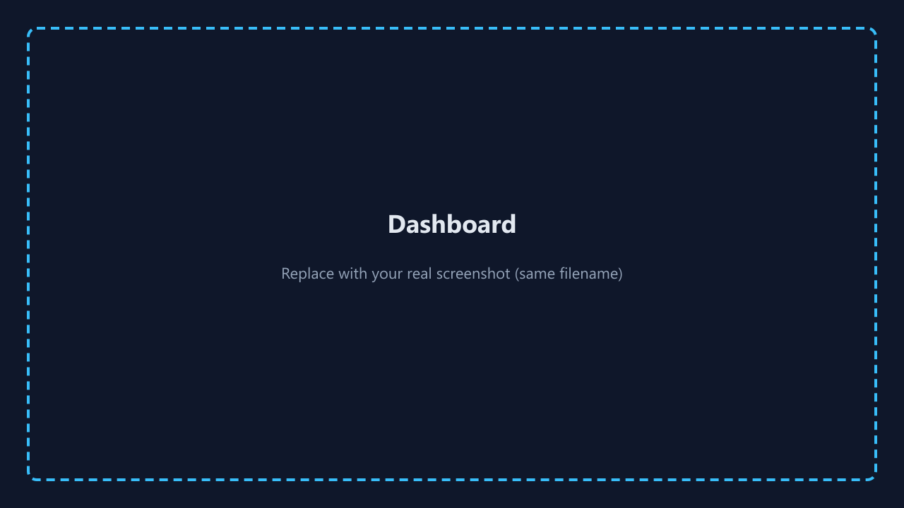
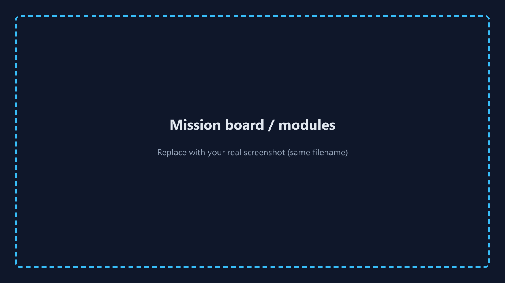
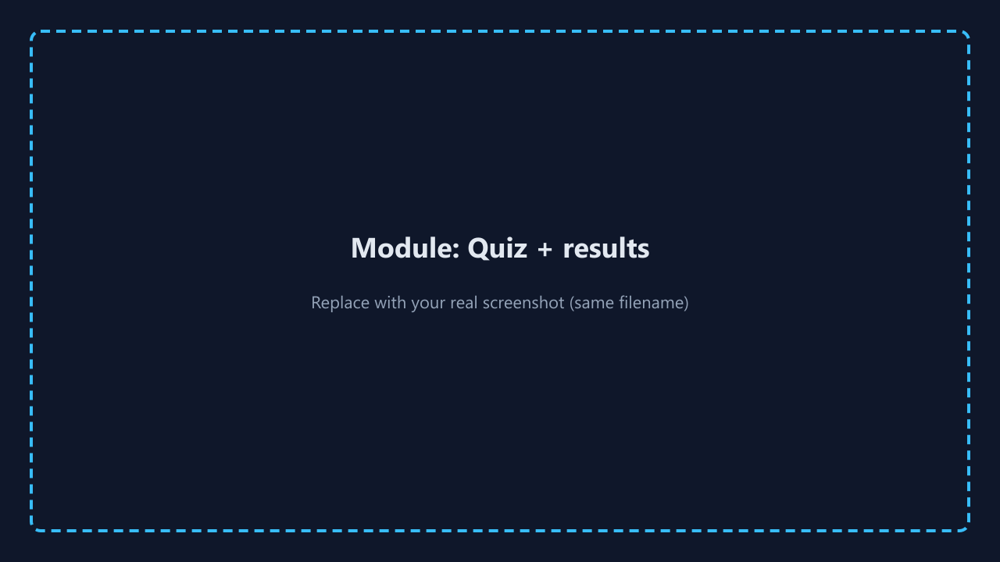

% CyberAware — Final presentation (COMP 4495 S002)
% Janvi Arora · 300383801
% W26

# CyberAware

**Web-Based Cybersecurity Awareness & Training Platform**

Team lead: Janvi Arora (300383801) — COMP 4495 S002 — W26

*For a **styled deck with backgrounds and images**, use `Presentation_CyberAware.md` in VS Code **Marp** → Export PPTX. This file is for **Pandoc-only** regeneration.*

# Problem & context

- Users targeted by phishing, weak passwords, social engineering.
- Need **learn → scenario → quiz → threat story** with **XP** and **saved progress**.

# Solution

- React + Vite + Supabase (Auth, Postgres, **RLS**).
- Six modules; flippable mission cards; achievements; profile.

# Screenshots (placeholders in repo)

Overwrite PNGs in `DocumentsAndReports/screenshots/` with real captures.

# Mission board

# Module — quiz

# Tech stack

| Layer | Technology |
|-------|------------|
| UI | React 18, React Router 6 |
| Build | Vite 5 |
| Backend | Supabase |

# Architecture

Browser SPA → Supabase Auth → Postgres (`profiles`, `user_progress`, `user_badges`) → RLS.

# Challenges

Schema alignment, 406/empty rows, env configuration guards.

# Evaluation & demo

Build passes; manual test matrix; live demo: landing → module → quiz → achievements.

# Thank you / Q&A

Repository: `Implementation/frontend_app/` on `main`.
